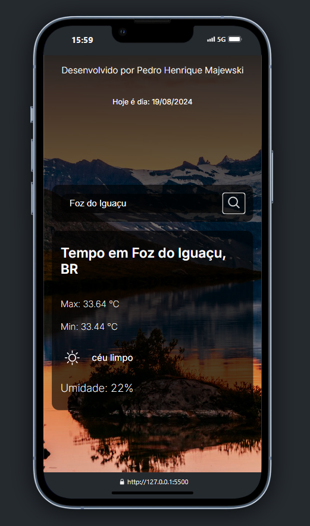

# Weather Forecast App

## Descrição

Este é um pequeno projeto desenvolvido como exercício para consulta da previsão do tempo, utilizando a API da [OpenWeather](https://openweathermap.org/api). A aplicação permite que o usuário pesquise o clima atual de qualquer cidade do mundo e exibe informações como temperatura, umidade, condição do tempo e muito mais.

## Funcionalidades

- Consulta da previsão do tempo em tempo real para qualquer cidade.
- Exibição da temperatura atual, umidade, velocidade do vento, e descrição das condições climáticas.
- Interface simples e intuitiva.

## Tecnologias Utilizadas

- **HTML5**: Estrutura do projeto.
- **SASS**: Estilização da interface.
- **JavaScript**: Lógica da aplicação e interação com a API.
- **API OpenWeather**: Fonte dos dados climáticos.

## Acesse Aqui:

https://previsao-tempo-projeto.vercel.app/

## Melhorias Futuras
Implementar previsão do tempo para os próximos dias.
Adicionar detecção automática da localização do usuário.
Melhorar a interface com animações e ícones.
Contribuições
Contribuições são bem-vindas! Sinta-se à vontade para enviar um pull request com melhorias ou abrir issues com sugestões e correções.

## Contato
Nome: Pedro Henrique Majewski
Email: pedrohmssilva@gmail.com
LinkedIn: [Pedro Henrique Majewski](https://www.linkedin.com/in/pedro-henrique-majewski-de-souza-e-silva/)
